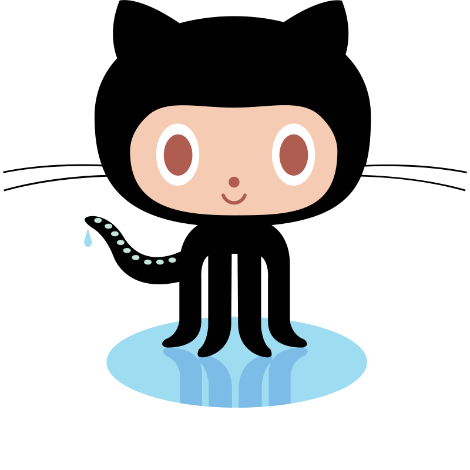

#   Hey there, Nice to meet you

I’m an AI/ML Engineer who likes building things end-to-end — not just models, but actual systems that work in the real world. I’ve worked across the spectrum: classical ML when it gets the job done, and LLMs or agents when the problem actually needs them.

I don’t really care about hype. I care about what works. Sometimes that’s a clean XGBoost pipeline. Sometimes it’s a messy LLM system you have to carefully control so it doesn’t fall apart.

Lately, I’ve been spending more time on systems that deal with language — building things that can read, reason, and respond in a way that feels useful (not just impressive demos).

Outside of code, I tend to go down rabbit holes.

I like breaking down AI papers to understand what’s actually new vs what’s just repackaged. I also spend time reading about geopolitics — mostly because complex systems fascinate me, whether they’re models or the real world.

And yeah, LeetCode is my version of a daily workout. Some people lift weights, I debug edge cases.

I’ve also been learning Russian (slowly 😅). It’s frustrating, but it makes you appreciate how nuanced language really is — something I keep bumping into while working on NLP problems.

## My Tech Stack
### 🖥️ Programming Languages 

    &nbsp;
    &nbsp;
    

  

### 🐍 Python Libraries & Frameworks
- #### Data Manipulation
    

        
        
    

- #### Data Visualisation
    

        &nbsp;
        
    

- #### Classical Machine Learning
    

        &nbsp;
        
    

- #### Deep Learning 
   

        
        &nbsp;
        
   

- #### REST API Frameworks
    

        &nbsp;&nbsp;
        
    

- #### Generative AI Frameworks
    

        &nbsp;
        &nbsp;
        
    
    

### 💾 Databases & Caching

    
    
    
    

### 📨 Message Broker

    

### 🧰 Version Control

    
    

### 🔨 IDE 

    
    

### 🌐 UI & Integration

    &nbsp;
    &nbsp;
    &nbsp;
    &nbsp;

### 🔗 Connect with me

**Let's connect and collaborate on exciting projects!**

<a href="mailto:kirtangoswami97@gmail.com" style="color: inherit; text-decoration: none;">
    &nbsp;
</a>
<a href="http://www.linkedin.com/in/kirtan-goswami" style="color: inherit; text-decoration: none;">
    &nbsp
</a>
<a href="https://discord.com/users/1022056952802594857" style="color: inherit; text-decoration: none;">
    &nbsp
</a>

