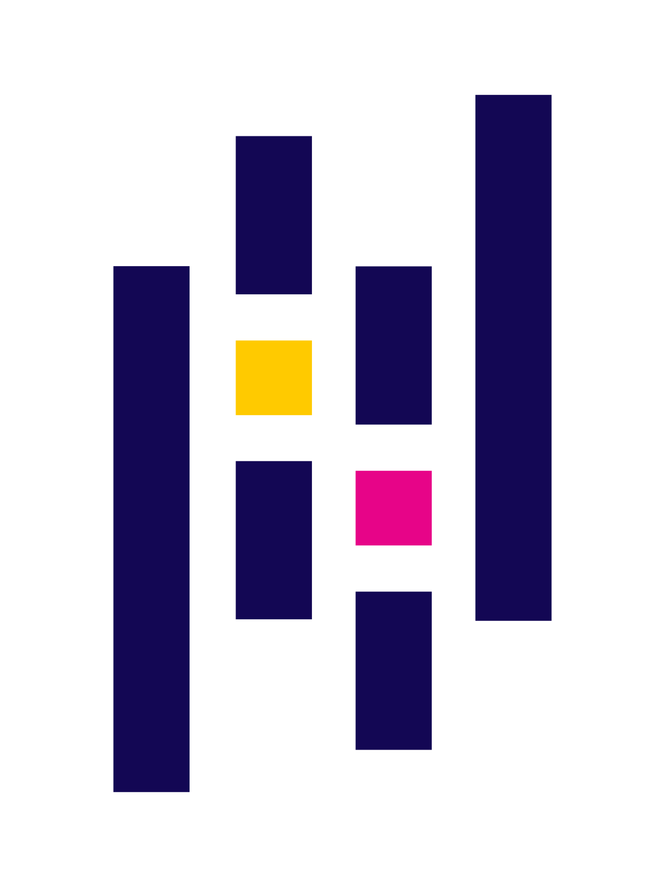
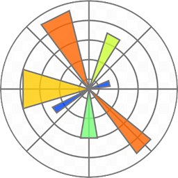
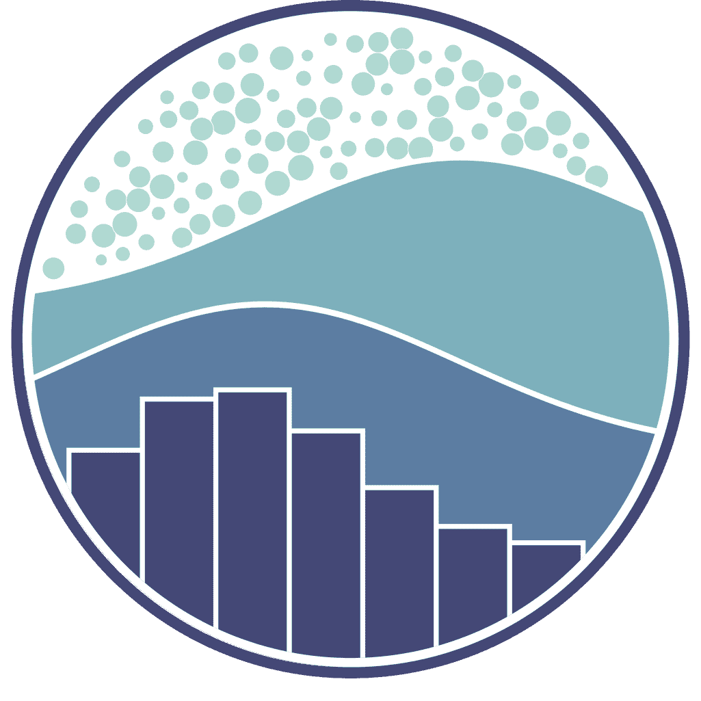
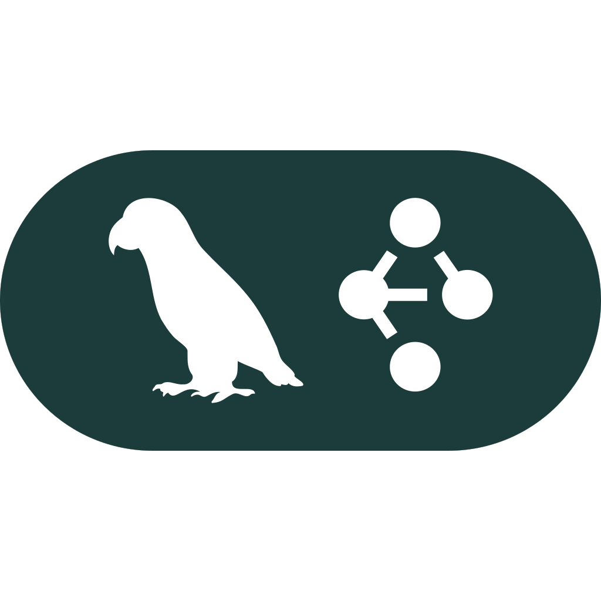
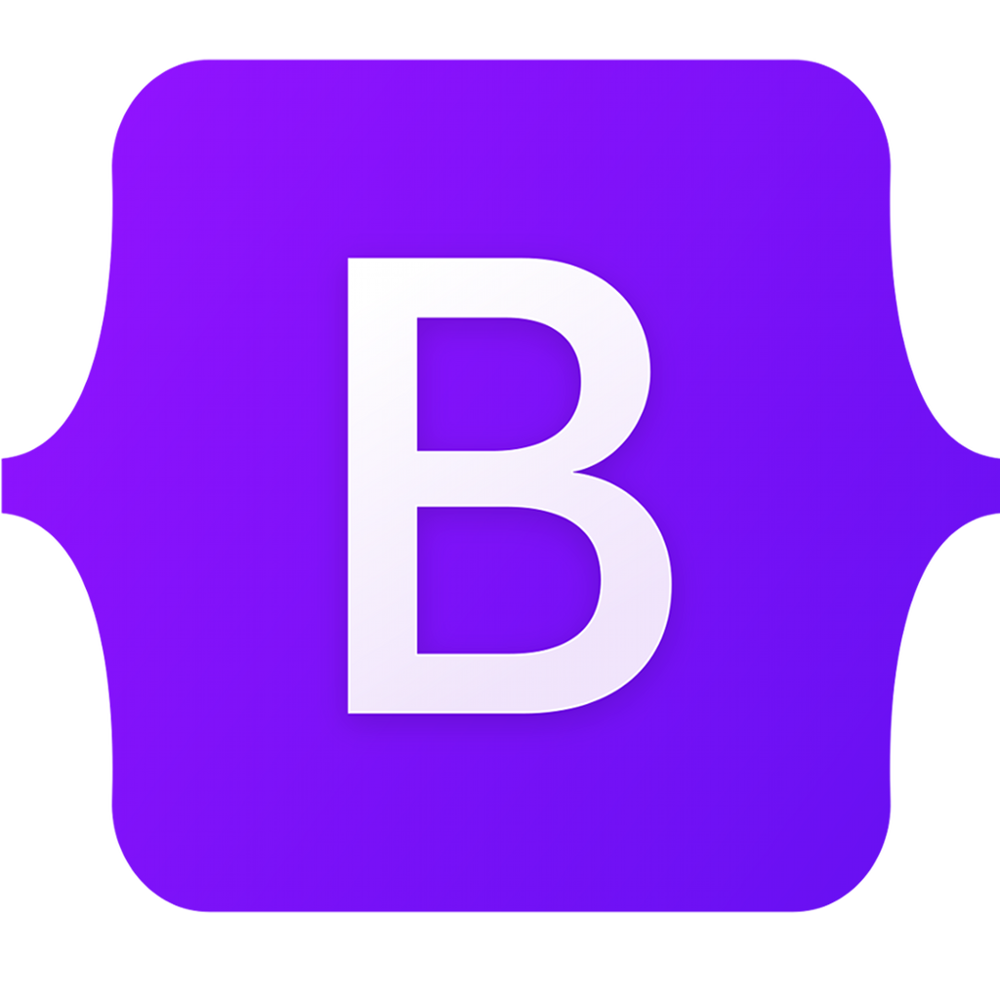

#   Hey there, Nice to meet you

I'm an AI/ML Engineer who loves the challenge of making sense of unstructured data.I specialize in orchestrating a symphony of AI models to build scalable, intelligent applications. My expertise spans the full spectrum of machine learning, from classical algorithms to state-of-the-art generative AI.

 

I'm excited to explore the depths of machine learning, particularly in the areas of deep learning and computer vision. I enjoy working on challenging projects and using my skills to solve complex problems and deliver high-quality solutions. 

## My Tech Stack
### 🖥️ Programming Languages 

    &nbsp;
    &nbsp;
    

  

### 🐍 Python Libraries & Frameworks
- #### Data Manipulation
    

        
        
    

- #### Data Visualisation
    

        &nbsp;
        
    

- #### Classical Machine Learning
    

        &nbsp;
        
    

- #### Deep Learning 
   

        
        &nbsp;
        
   

- #### REST API Frameworks
    

        &nbsp;
        
    

- #### Generative AI Frameworks
    

        &nbsp;
        &nbsp;
        
    
    

### 💾 Databases & Caching

    
    
    

### 🧰 Version Control

    
    

### 🔨 IDE 

    
    

### Web Development

    
    &nbsp;
    &nbsp;
    

### 🔗 Connect with me

**Let's connect and collaborate on exciting projects!**

